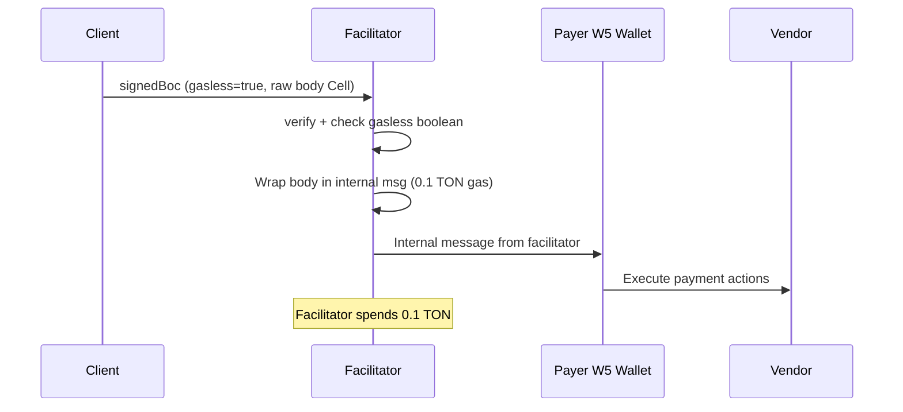
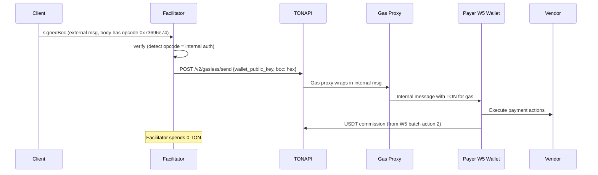
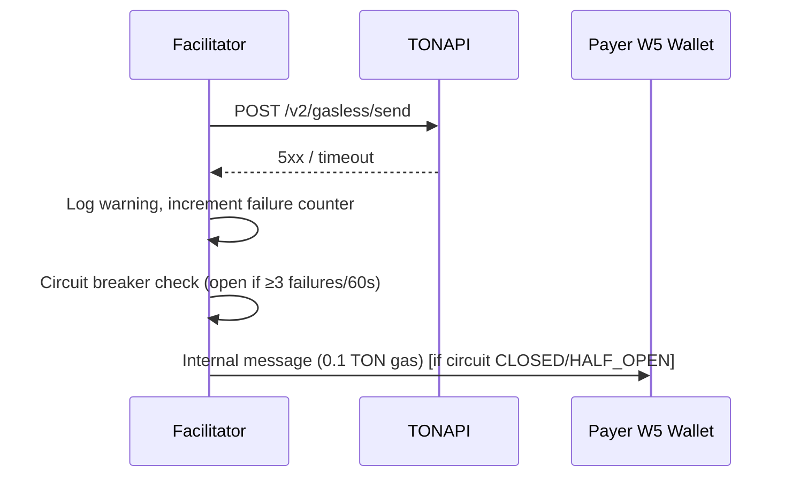

# Architecture

## Current State vs Target State

### Current (self-relay)


### Target (TONAPI relay)


### Fallback (TONAPI down → self-relay)


## Affected Files

### SDK (`packages/ton/src/`)

| File | Changes |
|------|---------|
| `types.ts:56-69` | Remove `gasless?: boolean` from `ExactTonPayload` |
| `types.ts` (new) | Add `GaslessConfig` interface for TONAPI config cache |
| `exact/client/scheme.ts:34-194` | Auto-detect asset: USDT → `authType: 'internal'`, TON → `authType: 'external'`. Always wrap in external message. Remove gasless param. |
| `exact/facilitator/scheme.ts:159-183` | Remove `payload.gasless` branching in body extraction. Always parse external-in message. Detect opcode after sig verification. |
| `exact/facilitator/scheme.ts:252` | Remove `payload.gasless` from opcode selection. Accept both opcodes, store detected value for settle routing. |
| `exact/facilitator/scheme.ts:345` | Change stateInit skip from `!payload.gasless` to opcode-based check. |
| `exact/facilitator/scheme.ts:367-374` | Change seqno=0 gasless rejection from `payload.gasless` to opcode `0x73696e74` check. |
| `exact/facilitator/scheme.ts:455-461` | Change emulation skip from `!payload.gasless` to opcode `0x73696e74` check. |
| `exact/facilitator/scheme.ts:494-525` | Settle: detect opcode → TONAPI broadcast or sendFile. Add TONAPI HTTP call. Fallback to self-relay on TONAPI error. |
| `exact/facilitator/scheme.ts:1042-1101` | Keep `broadcastGasless()` as fallback (renamed `broadcastSelfRelay()`) |
| `exact/facilitator/scheme.ts` (new) | Add `broadcastViaTonApi()` method — POST /v2/gasless/send. Uses AbortController with configurable timeout (default 10s). On timeout or 5xx, falls back to self-relay if circuit allows. |
| `exact/facilitator/scheme.ts` (constructor) | Extend existing `FacilitatorOptions` to include `tonApiKey` (already there for emulation) and `tonApiEndpoint` (new, optional). No new parameter — reuse the 4th param. |
| `constants.ts` | Add `GASLESS_SETTLEMENT_TIMEOUT_SECONDS = 60` |
| `index.ts` | Export new types/constants |

### Server (`server/src/`)

| File | Changes |
|------|---------|
| `config.ts` | Already has `tonapiKey`. Add `tonapiEndpoint` (optional, defaults to `https://tonapi.io`) |
| `index.ts:50-56` | Pass tonApiConfig to facilitator constructor. Fetch `/v2/gasless/config` at boot. Store relay_address and commission in shared cache. Start hourly refresh interval. |
| `routes/supported.ts` | Use TONAPI relay_address from cache as `relayAddress`. Use estimated commission from cache as `maxRelayCommission`. Receives cache reference as parameter. |
| `routes/verify.ts` | No changes needed — passthrough (does not reference `gasless` field directly) |
| `routes/settle.ts` | No changes needed — passthrough (does not reference `gasless` field directly) |

### Tests

| File | Changes |
|------|---------|
| `test/unit/client.test.ts` | Test USDT → authType internal auto-detection. Test always-external-message wrapping. |
| `test/unit/facilitator.test.ts` | Update gasless tests: remove `gasless: true` from payloads. Test opcode detection. Test TONAPI broadcast path (mock HTTP). Test self-relay fallback. Test circuit breaker state transitions. |
| `server/test/verify.test.ts` | Remove gasless field from test payloads |
| `server/test/verify-security.test.ts` | Remove gasless field from test payloads |
| `server/test/settle-security.test.ts` | Remove gasless field from test payloads |
| `server/test/supported.test.ts` | Update assertions: line 27-28 asserts facilitatorAddress as relayAddress — change to assert TONAPI relay_address from cache |

## Key Design Decisions

### 1. Opcode-based detection (not boolean flag)

The facilitator always parses the BOC as an external-in message, extracts the body, reads the first 32 bits (opcode), and routes:
- `0x7369676e` → direct broadcast via `sendFile`
- `0x73696e74` → TONAPI `/v2/gasless/send` (hex BOC)

### 2. Client auto-detection based on asset + relayAddress

```
if (asset !== 'native' && extra?.relayAddress) → authType: 'internal'
else → authType: 'external'
```

This is transparent to the integrator. No `gasless` parameter needed.

### 3. Always external message wrapping

Even with `authType: 'internal'`, the client wraps in an external message. This means:
- signedBoc format is identical for both paths
- Facilitator parsing is unified (always `loadMessage`)
- TONAPI receives the full external message (which is what it expects)

### 4. TONAPI as HTTP (no SDK dependency)

Raw `fetch()` calls to TONAPI endpoints. Avoids adding `@ton-api/client` as a dependency. The API is simple enough (3 endpoints, JSON request/response) that a thin wrapper suffices.

### 5. Commission flow

```
Boot: fetch /v2/gasless/config → relay_address
Boot: fetch /v2/gasless/estimate (sample USDT tx) → commission
Serve: /supported returns { relayAddress: relay_address, maxRelayCommission: commission }
Client: builds 2nd W5 action with commission to relay_address
Settle: broadcasts via TONAPI, relay keeps commission
```

No per-transaction `/estimate` call. Commission refreshed hourly.

### 6. TONAPI Config Data Flow (boot → supported route)

```
Server boot:
  1. fetch /v2/gasless/config → store relay_address in GaslessConfigCache
  2. fetch /v2/gasless/estimate (sample USDT tx) → store commission in GaslessConfigCache
  3. setInterval(hourlyRefresh, 3_600_000) — keeps cache fresh

Route wiring:
  app.get('/supported', supportedRoute(facilitator, gaslessCache))
  supportedRoute reads gaslessCache.relayAddress and gaslessCache.maxRelayCommission
  If cache is empty (boot fetch failed), /supported returns null relayAddress
  and falls back to facilitator address (self-relay mode)
```

### 7. Circuit Breaker (Self-Relay Fallback)

When TONAPI is unavailable the facilitator can fall back to self-relay (spending its own TON). Without a circuit breaker this drains the wallet for every transaction during an outage. The circuit breaker bounds the damage.

State machine:

```
CLOSED  ─(3 consecutive failures within 60s)→  OPEN
OPEN    ─(300s cooldown elapsed)→               HALF_OPEN
HALF_OPEN ─(TONAPI call succeeds)→              CLOSED
HALF_OPEN ─(TONAPI call fails)→                 OPEN
```

Thresholds (all configurable via `FacilitatorOptions`):

| Parameter | Default | Description |
|-----------|---------|-------------|
| `circuitBreakerThreshold` | 3 | Consecutive failures to open circuit |
| `circuitBreakerWindowMs` | 60 000 | Window in which failures are counted |
| `circuitBreakerCooldownMs` | 300 000 | Time circuit stays OPEN before HALF_OPEN |
| `maxDailySelfRelayTon` | 1.0 | Daily budget cap for self-relay (in TON) |

When the circuit is OPEN all gasless transactions are rejected with HTTP 503 (not silently self-relayed beyond the daily cap). When the daily budget is exhausted, self-relay is also rejected with HTTP 503. This prevents silent wallet drain.
